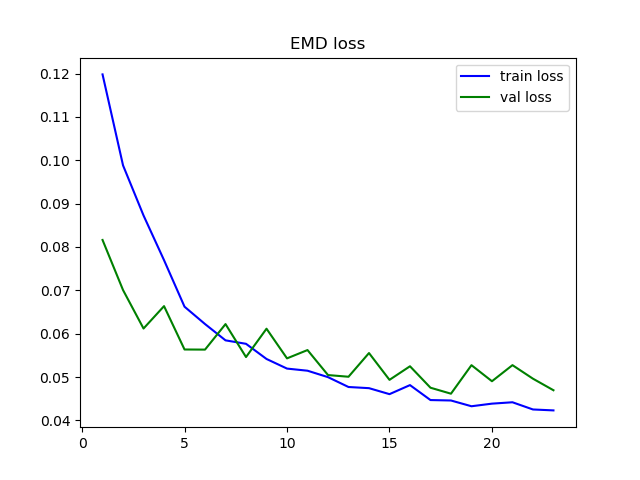

# Blind Image Quality Assessment
An implementation of the NIMA paper on the TID2013 dataset, using PyTorch. Achieves SRCC = 0.8513 on test data.

## TID2013 
Introduced in [this paper](https://www.sciencedirect.com/science/article/pii/S0923596514001490), TID2013 contains 3000 images obtained from 25 reference images with 24 types of distortions for each reference image, and 5 levels for each type of distortion. Though they are provided,reference images are not used as quality assessment is done in a blind setting (model is unaware of undistorted reference image). 
Each image is labelled with the mean (ranging from 0-9) and standard deviation of scores.
Some distortions included are :
* Gaussian Blur
* Additive and Multiplicative Gaussian Noise
* JPEG Compression
* Chromatic Aberration
* Contrast change

 

## Neural Image Assessment (NIMA) 
* Introduced in [this paper from Google Brain](https://arxiv.org/abs/1709.05424), NIMA uses retrained state-of-the-art deep object recognition networks such as Inceptionv2 and MobileNet for blind image quality estimation.
* Rather than just predict the mean score for an image, the classification head is replaced so that the model predicts the  distribution of human opinion scores.
* Earth mover's Distance (EMD) loss is used as the loss function, since both the output and targets are probability distributions.

* here p and phat are the target and output distributions, with N(for TID2013 N=10) ordered classes. CDF is the cumulative distribution function,r=2 as in the paper.
* TID2013 does not contain the distribution of scores, only their mean and std deviation. Hence max entropy probability distribution with given mean and std dev. is used as the ground truth.

## Implementation Details
* Mobilenet is used for lower size and faster training. 
* The model is initialised using pretrained weights (from training on ImageNet challenge)
* As in the paper, the classifier head is replaced with a dropout (p=0.75) layer preceding the dense layer of size 10.
* A softmax over the outputs of dense layer results in the predicted distribution of scores.
* In the paper, SGD (a momentum of 0.9) is used with learning rate of 3e-6 for the classification head and 3e-7 for all lower layers. I found this worked poorly for MobileNet. 
* I use an Adam optimizer with a learning rate of 3.7e-5 for classification head and 1.4e-4 for the base convolutional layers. The optimal values of learning rates were found by random search in log space.
* Early stopping is used, training is stopped when validation loss does not decrease over 10 epochs.

## Results 
* EMD loss on test data  = 0.0456
* SRCC on test data, plus or minus 0.03 within 95% confidence = 0.8513

## Usage
* Run `pynima.py` for training and subsequent testing.
* A train-val-test split of 70-20-10 split is used. Details can be found in `load_data.py`.
* `random_search.py` is used to find optimal learning rates.
